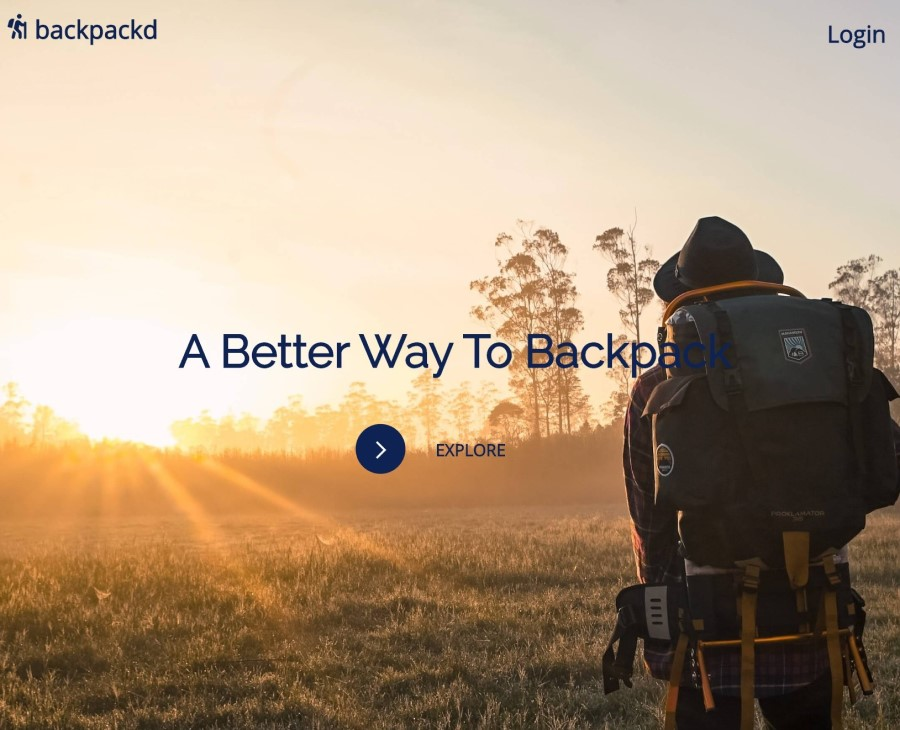
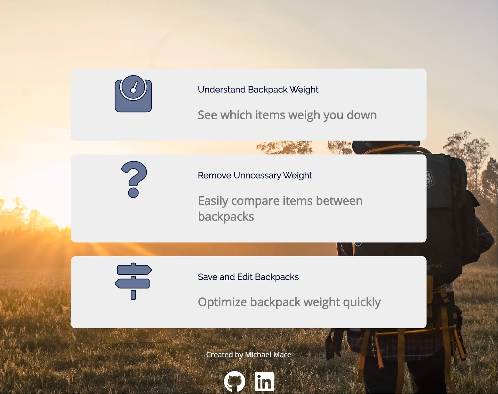
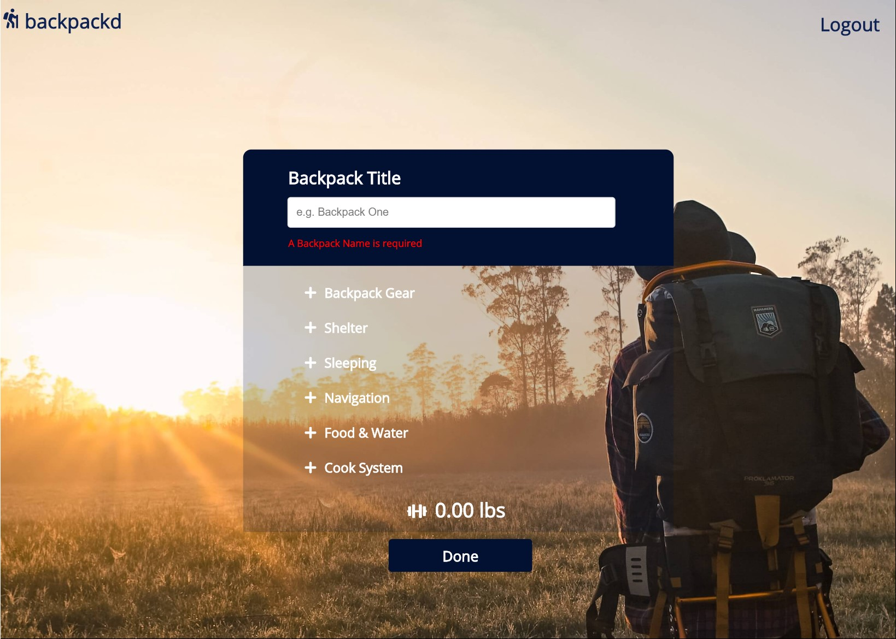
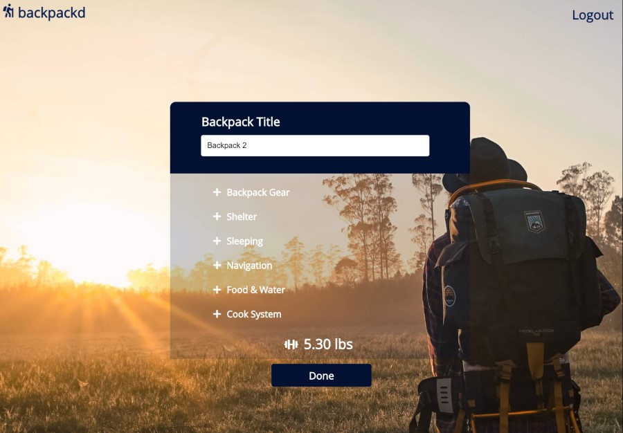

<!-- The name of your app at the top of the file -->

# backpackd

<!-- A link to your live app -->

## Live Page:

https://backpackd-app.now.sh/

## API Repo

https://github.com/mmbmf1/backpackd-server/

<!-- A summary section. This should have a concise explanation of what your app does. Try to frame this from the standpoint of what the user does, or what the app enables for the user. -->

## Summary:

backpackd allows a user to create and edit lits of backpacks. Items and their weight can be added to a backpack to calculate the total weight. Backpacks can also be deleted.

<!-- A section on the technology used. For your capstone, this is fairly simple (HTML/CSS/JavaScript/jQuery) but it's still good to list out the key technologies -->

## Technologies Used:

- PostgreSQL
- React.js
- Express.js
- Node.js
- CSS

<!-- Screenshot(s) of your app. This makes your app description much easier to understand. -->

## Landing Page:

## Backpacks Page:

## Add Backpacks Page:

## Edit Backpacks Page:

